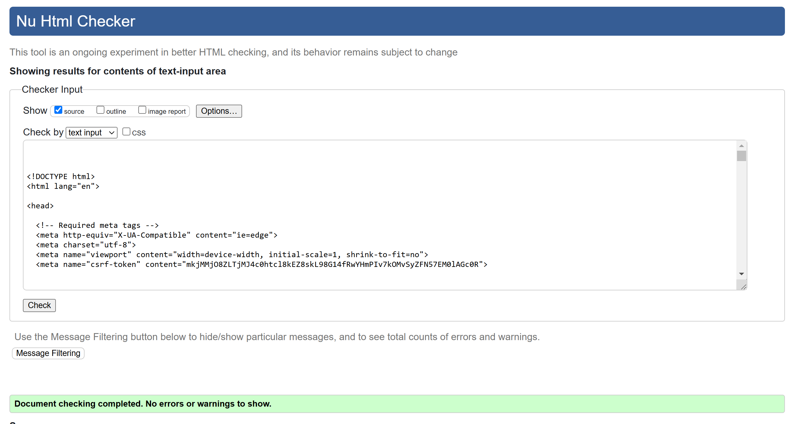
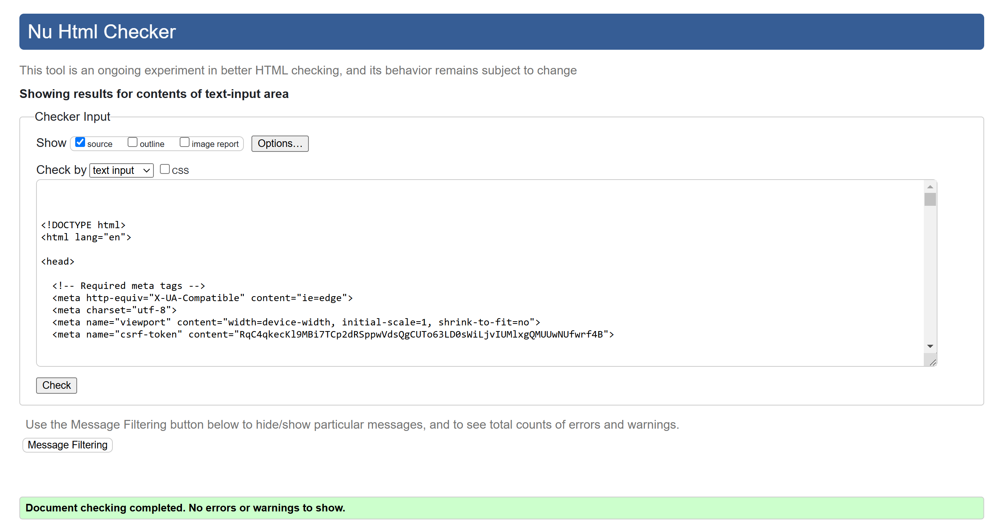

# The Equestrian Shop

 

## The equestrian shop to purchase all things equestrian

Grange Equestrian was developed to allow beginners, intermediate and advanced riders to be able to book a riding lesson with an instructor of choice. The user can enter the site or app, read about the different types of lessons, read about the instructors and then book a lesson that is available. The site is intended to give the user all the information that they would need to enable them to make an informed choice of which lesson and which instructor they need to book. The booking process shows days available and timeslots within those days for the user to book. Once booked the user is shown exactly what they have booked which awaits approval by the instructor. 

The site also allows the user to view all comments made by other users who have had a that specific lesson. If the user has had a lesson they can then leave a comment on that specific lesson. The users can also delete a comment or edit a comment that they have left on the lesson.

### Project Overview

[Grange Equestrian Live Demo](https://equestrian-online-a728dbfb5f33.herokuapp.com/)

### Key Features

- 
- Responsive design for various devices
- Ability to leave comments about the site or experience
- CRUD capability for user
- CRUD capability for Admin
- Ability for admin to add images, weekly bargains etc. Access to edit all aspects of the site.
- User authentication and profile management

### Target Audience

The site is designed for anybody interested in purchasing horse riding products. 

## Table of Contents

1. [Features](#features)
    - [Key Features Summary](#key-features-summary)

2. [User Experience (UX)](#user-experience-ux)
    - [User Stories](#user-stories)
    - [Design Choices](#design-choices)
    - [Wireframes](#wireframes)

3. [Information Architecture](#information-architecture)
    - [Sitemap](#sitemap)
    - [ERD Diagram](#erd-diagram)
    
4. [Technologies Used](#technologies-used)
    - [Languages](#languages)
    - [Frameworks](#frameworks)
    - [Databases](#databases)

5. [Agile Methodology](#agile-methodology)

6. [Deployment](#deployment)

7. [Testing](#testing)

8. [Bugs and Fixes](#bugs-and-fixes)

9. [Unsolved Issues and Bugs](#unsolved-issues-and-bugs)

10. [Future Developments](#future-developments)

11. [Credits](#credits)

## Features

### Key Features Summary

    - Home page where you can go directly to the shop or browse the site
    - User registration and login with form validation and error handling
    - Django admin panel for superuser to manage, users, bookings, instructors and lessons
    - Customised 404 error pages
    - Ability to comment on your experience
    - Full front and back end CRUD capability
    - Ability to view site comments
    - 
    - 
    - Contact us capability for the user
    - 

## User Experience (UX)

### Project Goals

#### Site Owner Goals

The site owner goals was to allow a user to visit the site, easily be able to navigate around the site,

#### User Goals

The user goals were to be able to easily purchase a product. 

### User Stories
User stories were used to drive this project. 
[User Stories (github issues)](https://github.com/Declan444/theshop/issues)
 
Kanban Board was used to control the project flow.
[Kanban Board (github project)](https://github.com/users/Declan444/projects/12)

### Landing Page
As a user I want to be able to visit the home page so that I can see a nav bar, header, main area and footer

#### Acceptance Criteria
    - The user can visit the landing page.
    - The user can see a navigation panel, header, main area and footer.
    - The user can see and usderstand easily the prupose of the site/app.

### Products Page
-   - As a user I want to be able to see the nav bar in the header for ease of navigation through the site.
    - As a user I want to be able to see all the products offered by the site.
    - As a user I want to be able to click on a product and be brought to a product details page.
    - As a user I want to be able to purchase this product, order a size if applicable and a quantity.
    - As a user I want to see the price, its star rating, its category, add to bag or keep shopping.

### All Products Link
As a user I want to be able see a link that will display all of the products in the range.

#### Acceptance Criteria
    - As a user I want to click the link to display a drop down menue which displays, price, rating, category and all products.
    - As a user I want to be able to click the price link and it will sort all products by price.
    - As a user I want to be able to click the ratings link and it will sort all products by rating.
    - As a user I want to be able to click category link and it will sort all products by category.

### HorseWare Page
As a user I want to be able to click on the horseware link and it will display a dropdown menu, showing Saddles, Bridles, Covers and extras.

#### Acceptance Criteria
    -  As a user I can click on each of the sublinks and it will display products from that category, e.g. saddles will display only saddles.
    

### Riderware Page
As a user I want to be able to click on the riderware link and it will display a drowdown menue showing the categories in riderware, Helmets, Jackets, Boots.

#### Acceptance Criteria
    -  As a user I can click on each of the sublinks and it will display products from that category, e.g. helmets will display helmets.

### Special Offers Page
As a user I want to be able to click on the special offers link and it will display a dropdown menu showing categories from this section e.g. new products, deals, Clearance.

#### Acceptance Criteria
    -  As a user I can click on each of the sublinks and it will display products from that category, e.g. new products will show new products.
    

### Reviews Page
As a user I want to be able to click on the reviews link to display a dropdown menu showing view reviews and leave a review.

#### Acceptance Criteria
    - As a user I click on the button and it displays a dropdown list. View reviews when click will display the reviews.
    - As a user I click on the leave a review link and it allows me to leave a review. 
    - As a logged in user, I want to be able to edit, delete, update and view my reviews.(CRUD)

### Register
As a user I want to be able to register so that I can become a registered user.

#### Acceptance Criteria
    - I want to be able to register with the site.
    - Once registered I want to be able to login.
    - Once registered I want to be able to logout.

### Contact Us Page
As a user I want to be able to leave a message so that I can get information from the site.

#### Acceptance Criteria
    - As a user I want to be able to click a contact us page when I am not registered.
    - As a user I want to be able to submit my information and leave a message.
    - As a use I want to be able to get a message to say that my message has been received.

### My Account
As a user I want to be able to login or register to the site using the my account button.

#### Acceptance Criteria
    - As a use when I click the my account I want to be able to login or register
    - As a user to register for the site I want to be able to leave my email address, Username and Password. 
    - As a user when I register I want to get a confirmation email to verify my email and register the user to the site.
    - As a user I want to be able to login with my username and password.
    - As a user I want to get notification that I am logged into the site.

### Newsletter
As a user I want to be able to subscribe to the site newsletter.

#### Acceptance Criteria
    - As a user I want to be able to enter my email address to subscribe to the site newsletter.

### My Account
As a logged in user I want to be able to see my profile, loyalty points and be able to logout.

#### Acceptance Criteria
    - As a logged in user I want to be able to click on my profile link and see my profile and my order history.
    - As a logged in user I want to be able to click on a past order and show the details of the order.
    - As a logged in user I want to be able to click on loyalty points and see my current loyalty points and their value.

### Design Choices
#### Colour Scheme
The colour scheme is 

#### Typography
For this project I choose Roboto as is modern and suited my concept.

#### Imagery
All background imagery is the property of Grange Equestrian. The images for the shop were taken from Mackey Equestrian Ireland and Tri Equestrian for demonstration purposes.

### Wireframes

## Information Architecture
### Sitemap

The following sitemap gives a visual flow of the Grange Equestrian Site.

### ERD Diagram

### Database Relationships

[Go to Table of Contents](#table-of-contents)

## Technologies Used
### Languages
    - HTML
    - CSS
    - Javascript
    - Python

### Frameworks & Libraries
The following resources were used to help implement the website:
- [GitHub](https://github.com/) for creating and storing files and folders of the website.
- **Git** was used for version control.
- **VScode** editor for writing the code.
- [Heroku](https://www.heroku.com) for accessing and storing my project.
- [Django](https://www.djangoproject.com/) Python framework for the overall project implementation.
- [Bootstrap](https://getbootstrap.com/) CSS framework that allowed to implement various styled elements, including modals. It was also used for quick and easy styling of the overall website.
- [Lucidchart](https://lucid.app/) for creating flowchart of the game.
- [CI Python Linter](https://pep8ci.herokuapp.com/#) for validating and checking my code for best code practices.
- [Whitenoise](https://whitenoise.readthedocs.io/en/stable/index.html) Python library used for handling static files.
- [Django allauth](https://allauth.org/) authentication solution for Django framework used for allowing users to register and login.
- [Django summernote](https://summernote.org/) Javascript library used for providing useful editing tools for Django admin site. 

Other libraries and dependencies can be seen in the requirements.txt file. 

See requirements.txt for full list.

### Databases
- SQLite (development)
-CI PostgreSQL (production)

## Agile Methodology

Used the agile approch as outlined in the Code Institute learning material with the development of a Kanban Board, user stories, tasks, aceptance criteria etc. 
It allowed me to be able to:
    - Respond quickly to changes 
    - Deliver working features incrementally
    - Maintain a clear overview of project progress for review when I returned to the project
    

## Deployment 

This website is deployed to Heroku from a GitHub repository, the following steps were taken:

## Creating Repository on Github

    - First make sure you are signed into Github and go to the code institutes template.
    - Then click on use this template and select Create a new repository from the drop-down. Enter the name for the repository and click Create repository from template.
    - Once the repository was created, I clicked the green gitpod button to create a workspace in gitpod so that I could write the code for the site.

## Creating an app on Heroku

- After creating the repository on GitHub, head over to [Heroku](https://www.heroku.com) and sign in.  
- On the home page, click New and Create new app from the drop down.
- Give the app a name(this must be unique) and select a region I chose Europe as I am in Europe, Then click Create app.

## Create a database

- Login to [Cldatabase maker](https://dbs.ci-dbs.net/)
- add hour email address in the input field and submit the form
- open database link in your email
- past database URL in your DATABASE_URL variable in env.py file and in Heroku config vars

## Deploying to Heroku

- Head back over to [Heroku](https://www.heroku.com) and click on your app and then go to the Settings tab
- On the settings page scroll down to the config vars section and enter the DATABASE_URL which you will set equal to the elephantSQL URL, create Secret key this can be anything,  CLOUDINARY_URL this will be set to your cloudinary url and finally Port which will be set to 8000.
- Then scroll to the top and go to the deploy tab and go down to the Deployment method section and select Github and then sign into your account.
- Below that in the search for a repository to connect to search box enter the name of your repository that you created on GitHub and click connect
- Once it has been connected scroll down to the Manual Deploy and click Deploy branch when it has deployed you will see a view app button below and this will bring you to your newly deployed app.
- Please note that when deploying manually you will have to deploy after each change you make to your repository.

## Testing

## Code Validation
### HTML Validation

HTML was validated using the [W3C Markup Validation Service](https://validator.w3.org/) for all pages. As the project uses Django templates, the HTML was validated by copying the rendered HTML from the browser into the validator.

No errors and no warnings were found

### CSS Validation

No errors and no warnings were found

### Lighthouse Test

### JSHint Validator

### CI Phyton Linter

This is an example of the views.py result. All other python code pages were checked in CI Phython linter.

### Manual Testing User Stories

Manual Testing file for user stories can be found in the [Manual Testing UserStory File](onlineshop/readme_assets/testing/userstory_manual_testing.md)

### Manual Testing Features

Manual Testing file can be found in the [Manual Testing File](onlineshop/readme_assets/testing/manual_testing.md)

### Automated Testing

Automated Testing was carried out using the local sqlite3 database. This was configured in the settings.py file for test. This allowed me to carry out the tests on this db only.

Automated Testing file can be found in the [Automated Testing File](onlineshop/readme_assets/testing/automated_testing.md)

## Bugs and Fixes

One challenging aspect of this build was ensuring that any date in the past would be non-active, preventing users from booking a date or lesson that had already passed. After many failed attempts, I implemented the following code in my `book_a_lesson` view. This code creates a dictionary that tracks whether each day of a given month is in the past. It loops through the month’s days, formats each day as a string, and checks if it is before today. The result is stored in `dates_status_dict`.

dates_status_dict = {}
for week in month_days:
    for day in week:
        if day:
            day_formatted = f"{day:02d}"
            month_formatted = f"{month:02d}"
            year_formatted = f"{year:04d}"
            day_date_str = (
                f"{day_formatted}-{month_formatted}-{year_formatted}"
            )
            day_date = datetime.strptime(day_date_str, "%d-%m-%Y").date()
            is_past = day_date < today
            dates_status_dict[day_date_str] = is_past

context = {
    "year": year,
    "month": month,
    "prev_year": prev_year,
    "prev_month": prev_month,
    "next_year": next_year,
    "next_month": next_month,
    "month_days": month_days,
    "today_date_str": today_date_str,
    "dates_status": dates_status_dict,  # Pass as a dictionary
}
 
I then created this code a custom template filter get_item which allows the template and retrieve booking status from the dates_status_dict by using the date string as a key.
 
@register.filter(name="get_item")
def get_item(dictionary, key):
    return dictionary.get(key, "Not Found")

Then I use the get_item in the template


This solved my problem and all dates past are not active so the user cannot book a lesson that is in the past.

Another problem I had was when a user clicked the edit button in the comments section on mobile device, the screen stayed on the button and did not jump to the edit comment text box. This was confusing for the user as it seemed that nothing happened. I solved this by adding  commentText.scrollIntoView({bahavior: 'smooth '}); line of code to the comments.js file. While seems easy, took a while to get to work. 

## Unsolved Issues and Bugs

A bug I believe is that a user can book a lesson. They can then go and make a comment about the lesson even before they have had the lesson. Why a user would do this I am not sure but it can happen.

## Future Developments

## Late additions 

## Credits

## Credits

## Content
All of text and code in this project was generated by myself.

Problems encountered

Total order quantity value not updating in the admin. Signals being sent for update and delete. Can update and delete from the admin but not updating when 
the order form is being filled in on the site. Order is being processed and success message is being displayed, order is present on the stripe transactions page. not recording the item size. Needs to be solved.

webhook now working. Need to read documentation to allow to work. Walkthrough out of date. Fixed

emails set up but not working. Assume its because of the webhook not working for the stripe payments. Fixed

If a user applies their loyalty points but does not pay and logs out, the loyalty points are lost. Need to figure this out.

if request.user.is_authenticated:
        loyalty_points_obj = LoyaltyPoints.objects.filter(user=request.user).first()
        loyalty_points = loyalty_points_obj.points if loyalty_points_obj else 0
    else:
        loyalty_points = 0

 # Debugging information before applying points
    print(f"Grand Total before Applying Points: {grand_total}")
    print(f"User Loyalty Points (Available): {loyalty_points}")
    print(f"Points Requested to Apply: {points_applied}")

    if request.user.is_authenticated and loyalty_points > 0:
        # Dynamically calculate points to apply
        points_applied = min(loyalty_points, grand_total - 1)  
        grand_total -= points_applied  # Deduct points from the grand total
        loyalty_points -= points_applied  # Deduct applied points from user's available points

    # Debugging information
    print(f"Grand Total before Applying Points: {delivery + total}")
    print(f"User Loyalty Points (Available): {loyalty_points + points_applied}")
    print(f"Points Requested to Apply: {points_applied}")
    print(f"Grand Total after Applying Points: {grand_total}")
    print(f"User Loyalty Points (Remaining): {loyalty_points}")