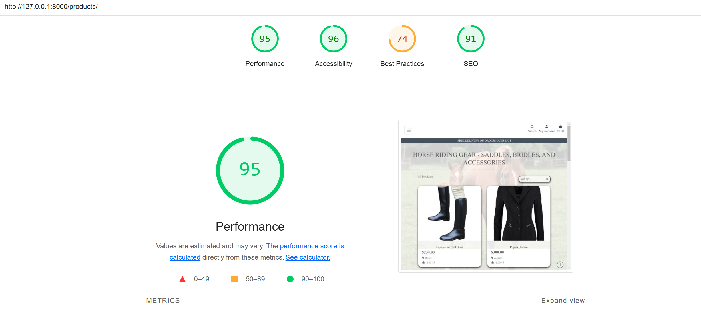
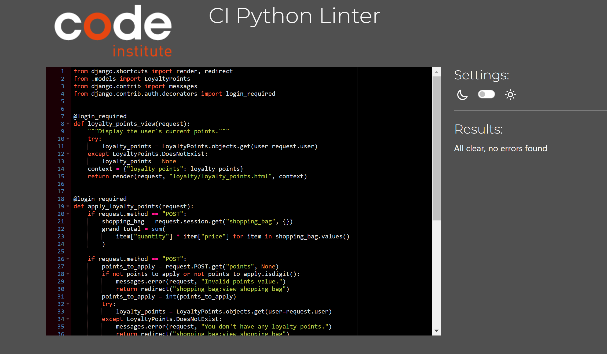

# The Equestrian Shop

 

## The equestrian shop to purchase all things equestrian

The equestrian online shop was developed to allow users who are interested in purchasing equestrian products to find and purchase products from for this market. The user can enter the site by clicking shop now which will bring them to the products section. The user can easily see the products available and has the ability to sort the products using various methods or search the site for specific products e.g. saddle, bridle etc. The user can purchase products without registering to the site or they can register and then login which will allow them to gain loyalty points which convert to euro and these can be applied to future purchases. The shop also allows the user to view comments, leave comments and edit or delete their own comments. The aim of the site is to allow users to purchase products as easily as possible and to view all the products that are available for sale. 

### Project Overview

The Equestrian Online shop site is intended to offer a user-friendly interface to allow the user to browse products and also to purchase any desired products. The site is aimed to be simple to navigate, clean and simple design which highlights the products, follows a logical flow which is intuitive for the user. The site follows the core structore of the Code Institute Boutique Ado walkthrough with the user of django and deploying to heroku. The project uses AWS for image storage, allows the user to subscribe to a newsletter and the site implements a loyalty program for registered users purchases.

[Grange Equestrian Live Demo](https://equestrian-online-a728dbfb5f33.herokuapp.com/)

### Key Features

- 
- Responsive design for various devices
- Ability to leave comments about the site or experience
- CRUD capability for user
- CRUD capability for Admin
- Ability for admin to add images, weekly bargains etc. Access to edit all aspects of the site.
- User authentication and profile management
- Loyalty points for all purchases
- Ease to understand and find products in the site

### Target Audience

The site is designed for anybody interested in purchasing horse riding products. 

## Table of Contents

1. [Features](#features)
    - [Key Features Summary](#key-features-summary)

2. [User Experience (UX)](#user-experience-ux)
    - [User Stories](#user-stories)
    - [Design Choices](#design-choices)
    - [Wireframes](#wireframes)

3. [Information Architecture](#information-architecture)
    - [Sitemap](#sitemap)
    - [ERD Diagram](#erd-diagram)
    
4. [Technologies Used](#technologies-used)
    - [Languages](#languages)
    - [Frameworks](#frameworks)
    - [Databases](#databases)

5. [Agile Methodology](#agile-methodology)

6. [Business Model, SEO & Marketing](#business-model-seo--marketing)
    - [Business Model](#business-model)
    - [SEO](#seo)
    - [Marketing](#marketing)

7. [Deployment](#deployment)

8. [Testing](#testing)

9. [Bugs and Fixes](#bugs-and-fixes)

10. [Unsolved Issues and Bugs](#unsolved-issues-and-bugs)

11. [Future Developments](#future-developments)

12. [Credits](#credits)

## Features

### Key Features Summary

    - Home page where you can go directly to the shop or browse the site
    - View and sort products
    - Purchase products and increase and decrease quantities of products
    - Search products by category, rating, price
    - Search the site by product name or word
    - User registration and login with form validation and error handling
    - Django admin panel for superuser to manage, products, users, email addresses, orders, loyalty points, newsletter subscriptions, categories, products, user profiles and reviews
    - Customised 404 error pages
    - Ability to leave a comment and have CRUD capability on your comments
    - Loyalty points gained for purchases
    - Ability to view site comments
    - Contact us form
    - Newsletter subscription
    - View your profile
    - View your shopping basket

## User Experience (UX)

### Project Goals

#### Site Owner Goals

The site owner goals was to be able to update the products either through the frontend or the backend. Completely update all the information about the products, view orders and all email addresses. The site owner should have full control over the site i.e. uploading products, images, setting prices, etc.

#### User Goals

The site user goals was to visit the site, easily be able to navigate around the site to find equestrian products. The user can login to the site, register, view products and purchase products. The user can sort through the products for ease of finding the correct product. The user will gain loyalty points for all purchases. The user can leave comments and subscribe to the site newsletter. 

### User Stories
User stories were used to drive this project. 

### Landing Page
As a user I want to be able to visit the home page so that I can see a nav bar, header, main area and footer

#### Acceptance Criteria
    - The user can visit the landing page.
    - The user can see a navigation panel, header, main area and footer.
    - The user can see and usderstand easily the prupose of the site/app.

### Products Page
-   - As a user I want to be able to see the nav bar in the header for ease of navigation through the site.
    - As a user I want to be able to see all the products offered by the site.
    - As a user I want to be able to click on a product and be brought to a product details page.
    - As a user I want to be able to purchase this product, order a size if applicable and a quantity.
    - As a user I want to see the price, its star rating, its category, add to bag or keep shopping.

### All Products Link
As a user I want to be able see a link that will display all of the products in the range.

#### Acceptance Criteria
    - As a user I want to click the link to display a drop down menue which displays, price, rating, category and all products.
    - As a user I want to be able to click the price link and it will sort all products by price.
    - As a user I want to be able to click the ratings link and it will sort all products by rating.
    - As a user I want to be able to click category link and it will sort all products by category.

### HorseWare Page
As a user I want to be able to click on the horseware link and it will display a dropdown menu, showing Saddles, Bridles, Covers and extras.

#### Acceptance Criteria
    -  As a user I can click on each of the sublinks and it will display products from that category, e.g. saddles will display only saddles.
    

### Riderware Page
As a user I want to be able to click on the riderware link and it will display a drowdown menue showing the categories in riderware, Helmets, Jackets, Boots.

#### Acceptance Criteria
    -  As a user I can click on each of the sublinks and it will display products from that category, e.g. helmets will display helmets.

### Special Offers Page
As a user I want to be able to click on the special offers link and it will display a dropdown menu showing categories from this section e.g. new products, deals, Clearance.

#### Acceptance Criteria
    -  As a user I can click on each of the sublinks and it will display products from that category, e.g. new products will show new products.
    

### Reviews Page
As a user I want to be able to click on the reviews link to display a dropdown menu showing view reviews and leave a review.

#### Acceptance Criteria
    - As a user I click on the button and it displays a dropdown list. View reviews when click will display the reviews.
    - As a user I click on the leave a review link and it allows me to leave a review. 
    - As a logged in user, I want to be able to edit, delete, update and view my reviews.(CRUD)

### Register
As a user I want to be able to register so that I can become a registered user.

#### Acceptance Criteria
    - I want to be able to register with the site.
    - Once registered I want to be able to login.
    - Once registered I want to be able to logout.

### Contact Us Page
As a user I want to be able to leave a message so that I can get information from the site.

#### Acceptance Criteria
    - As a user I want to be able to click a contact us page when I am not registered.
    - As a user I want to be able to submit my information and leave a message.
    - As a use I want to be able to get a message to say that my message has been received.

### My Account
As a user I want to be able to login or register to the site using the my account button.

#### Acceptance Criteria
    - As a use when I click the my account I want to be able to login or register
    - As a user to register for the site I want to be able to leave my email address, Username and Password. 
    - As a user when I register I want to get a confirmation email to verify my email and register the user to the site.
    - As a user I want to be able to login with my username and password.
    - As a user I want to get notification that I am logged into the site.

### Newsletter
As a user I want to be able to subscribe to the site newsletter.

#### Acceptance Criteria
    - As a user I want to be able to enter my email address to subscribe to the site newsletter.

### My Account
As a logged in user I want to be able to see my profile, loyalty points and be able to logout.

#### Acceptance Criteria
    - As a logged in user I want to be able to click on my profile link and see my profile and my order history.
    - As a logged in user I want to be able to click on a past order and show the details of the order.
    - As a logged in user I want to be able to click on loyalty points and see my current loyalty points and their value.

### Design Choices
#### Colour Scheme

The colour scheme is 

#### Typography
For this project I choose Roboto as is modern and suited my concept.

#### Imagery
All background imagery is the property of Equestrian Online. The images for the shop were taken from Mackey Equestrian Ireland and Tri Equestrian for demonstration purposes.

### Wireframes
## Main Pages

## Checkout Page

## Detailed Product Page

## Detailed Product Page with Success Message

## Shopping Bag Page

## Information Architecture
### Sitemap

The following sitemap gives a visual flow of the Grange Equestrian Site.

### ERD Diagram

## Database Relationships

### User to User Profile: One to One.

The user can only have one profile that is associated with each specific user. 
The userprofile model has a onetoonefield with user.

### User Profile to Order: One to Many.

The userprofile can have many orders. 
The order model has a foreign key to user profile.

### Loyalty Points to User: One to One.

The loyalty points model has a one to one relationship with the user. The user can only contain 1 set of loyalty points.

### Review to User: Many to One.

The user leave many reviews.

### Category to Products: One to Many.

Each category can have many products.

### Order to OrderLineItem: One to Many.

Each order can contain many lineItems. This acts as a bridge between the products and the orders.

[Go to Table of Contents](#table-of-contents)

## Technologies Used
### Languages
    - HTML
    - CSS
    - Javascript
    - Python

### Frameworks & Libraries
The following resources were used to help implement the website:
- [GitHub](https://github.com/) for creating and storing files and folders of the website.
- **Git** was used for version control.
- **VScode** editor for writing the code.
- [Heroku](https://www.heroku.com) for accessing and storing my project.
- [Django](https://www.djangoproject.com/) Python framework for the overall project implementation.
- [Bootstrap](https://getbootstrap.com/) CSS framework that allowed to implement various styled elements, including modals. It was also used for quick and easy styling of the overall website.
- [Lucidchart](https://lucid.app/) for creating flowcharts.
- [CI Python Linter](https://pep8ci.herokuapp.com/#) for validating and checking my code for best code practices.
- [Whitenoise](https://whitenoise.readthedocs.io/en/stable/index.html) Python library used for handling static files.
- [Django allauth](https://allauth.org/) authentication solution for Django framework used for allowing users to register and login.
- AWS S3 Bucket
- JQuery
- Django allauth

Other libraries and dependencies can be seen in the requirements.txt file. 

See requirements.txt for full list.

### Databases
- SQLite (development)
-CI PostgreSQL (production)

## Agile Methodology

Used the agile approch as outlined in the Code Institute learning material with the development of a Kanban Board, user stories, tasks, aceptance criteria etc. 
It allowed me to be able to:
    - Respond quickly to changes 
    - Deliver working features incrementally
    - Maintain a clear overview of project progress for review when I returned to the project
    

### Business Model, SEO & Marketing

The Business Mode, SEO and Marketing file can be viewed here

[SEO Guide](onlineshop/readme_assets/seo/seo.md)

## Deployment 

This website is deployed to Heroku from a GitHub repository, the following steps were taken:

## Creating Repository on Github

    - First make sure you are signed into Github and go to the code institutes template.
    - Then click on use this template and select Create a new repository from the drop-down. Enter the name for the repository and click Create repository from template.
    - Once the repository was created, I clicked the green gitpod button to create a workspace in gitpod so that I could write the code for the site.

## Creating an app on Heroku

- After creating the repository on GitHub, head over to [Heroku](https://www.heroku.com) and sign in.  
- On the home page, click New and Create new app from the drop down.
- Give the app a name(this must be unique) and select a region I chose Europe as I am in Europe, Then click Create app.

## Create a database

- Login to [Cldatabase maker](https://dbs.ci-dbs.net/)
- add email address in the input field and submit the form
- open database link in your email
- past database URL in your DATABASE_URL variable in env.py file and in Heroku config vars

## Deploying to Heroku

I have included details of deployment in a separate file [deployment.md](deployment.md).

- Head back over to [Heroku](https://www.heroku.com) and click on your app and then go to the Settings tab
- On the settings page scroll down to the config vars section and enter the DATABASE_URL which you will set equal to the postgress URL, create Secret key this can be anything,  input your AWS_ACCESS_KEY_ID and your  AWS_SECRET_ACCESS_KEY. Add in USE-AWS as True in the config vars. As in this project I used AWS, these were neccessary for storing media and static files.
- As this site uses Stripe for payment, the stripe public, stripe secret and stripe WH Secret keys are stored in the config vars section of heroku.
- This site also used email verification and email host pass and email host user were also added to the config vars section of heroku.
- Then scroll to the top and go to the deploy tab and go down to the Deployment method section and select Github and then sign into your account.
- Below that in the search for a repository to connect to search box enter the name of your repository that you created on GitHub and click connect
- Once it has been connected scroll down to the Manual Deploy and click Deploy branch when it has deployed you will see a view app button below and this will bring you to your newly deployed app.
- Please note that when deploying manually you will have to deploy after each change you make to your repository.

## Testing

## Code Validation
### HTML Validation

HTML was validated using the [W3C Markup Validation Service](https://validator.w3.org/) for all pages. As the project uses Django templates, the HTML was validated by copying the rendered HTML from the browser into the validator. All pages were tested and examples are below.

Landing Page

Products Page

Checkout Success Page

Contact Us Page

No errors and no warnings were found

### CSS Validation

No errors or warnings were found.

### Lighthouse Test

Landing Page

Products Page

Lighthouse Best Practices Results

### JSHint Validator

### CI Phyton Linter

This is an example of the views.py result. All other python code pages were checked in CI Phython linter.

Checkout View Code

Contact Us View Code

Loyalty App View Code

Newsletter App View Code

Products App View Code

Profiles App View Code

Reviews App View Code

Shopping Bag App View Code

### Manual Testing User Stories

Manual Testing file for user stories can be found in the [Manual Testing UserStory File](onlineshop/readme_assets/testing/userstory_manual_testing.md)

### Manual Testing Features

Manual Testing file can be found in the [Manual Testing File](onlineshop/readme_assets/testing/manual_testing.md)

### Automated Testing

Automated Testing was carried out using the local sqlite3 database. This was configured in the settings.py file for test. This allowed me to carry out the tests on this db only.

Automated Testing file can be found in the [Automated Testing File](onlineshop/readme_assets/testing/automated_testing.md)

## Bugs and Fixes

### Loyalty Points

I decided to try to implement  a loyalty points system to challenge myself and it definately did challenge me. The system is very basic but can be build upon. I have set it up so that 100 euro spend is 1 point. Then this one point can be converted to 1 euro and then applied just before payment. This system was a challenge e.g
- if the user had more points value than the purchase, all points would be applied to the purchase
- if the user had more points value than the purchase, the user would get money back on the order
- the correct applied points value would not be removed from the total users points value.
- if the user had all the points and the points value equaled the purchase value, the purchase value would be zero and stripe would not work. 
- if stripe not working the user purchase details would not be recorded. 

All of the above were fixed and now work through constant debugging example below;-

#### Debugging information before applying points
    print(f"Grand Total before Applying Points: {grand_total}")
    print(f"User Loyalty Points (Available): {loyalty_points}")
    print(f"Points Requested to Apply: {points_applied}")

    if request.user.is_authenticated and loyalty_points > 0:
        # Dynamically calculate points to apply
        points_applied = min(loyalty_points, grand_total - 1)  
        grand_total -= points_applied  # Deduct points from the grand total
        loyalty_points -= points_applied  # Deduct applied points from user's available points

    # Debugging information
    print(f"Grand Total before Applying Points: {delivery + total}")
    print(f"User Loyalty Points (Available): {loyalty_points + points_applied}")
    print(f"Points Requested to Apply: {points_applied}")
    print(f"Grand Total after Applying Points: {grand_total}")
    print(f"User Loyalty Points (Remaining): {loyalty_points}")

The total order quantity value not updating in the admin. Signals being sent for update and delete as I did a print to check. Can update and delete from the admin but not updating when 
the order form is being filled in on the site. Order is being processed and success message is being displayed, order is present on the stripe transactions page. not recording the item size. This caused me alot of problems

I couldn't get the webhook to work from the walkthrough. This caused me endless pain as it effected lots of other parts of the build. The course content is pretty much out of date when it comes to stripe. The fix was my mentor recommended I purchase Django 5 book which I did and I used this as a reference where possible for the stipe fix. 

I have asked friends to check if they can find any other errors in the site and have tested it manually myself. 

## Unsolved Issues and Bugs

If a user applies their loyalty points but does not pay and logs out, the loyalty points are lost. I have placed a warning on the shopping bag page where the user can apply the loyalty points to let them know but it is a bug.  

## Future Developments

If I had the time I would continue to develop the loyalty points system. The apply loyalty points action could be integrated with the stripe purchase form so the user could user their points there. I would add other methods to build loyalty points to the site. 

## Credits

I'd like to thank Spencer Barriball, my mentor at Code Institute, for giving me valuable guidance and support throught the duration of this project. The majority of my learning came from the Code Institute course content and the Boutique Ado Walk Through. This allowed me to set our the structure of the site and to create the backbone of the site from which to build. Without this starting point and both the walkthrough course content and the Django 5 by Example book, it would have been impossible.  I used Django 5 By Example book to solve some stripe issues. This book was recommended by my mentor. A constant go to that I use is https://developer.mozilla.org/en-US/docs/Web/JavaScript/Guide as suggested by my mentor. I always use https://www.w3schools.com/ as a go to for all code understanding ranging from python to bootstrap to javascript. I used https://learndjango.com/tutorials/customizing-django-404-and-500-error-pages for error pages and other areas of django. A regular go to was https://docs.djangoproject.com/en/5.1/. My standard go to for python is https://docs.python.org/3.12/library/index.html .

## Content
All of text and code in this project was generated by myself.
