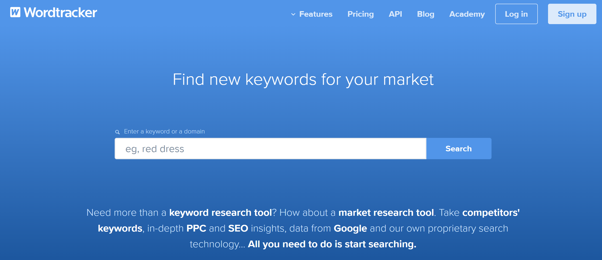
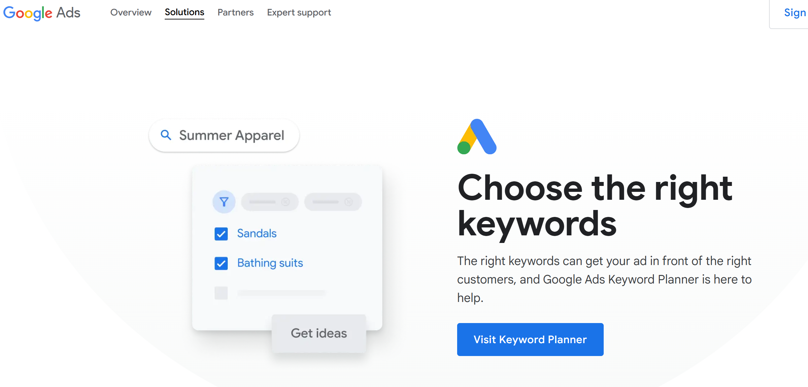

### Business Model, SEO & Marketing for Equestrian Online

## Business Model

Equestrian Online is an online shop to supply equestrian goods to the equestrian market. The demographic of this market ranges across all ages and across all types. Anyone that has a horse will be in the market for equestrian products. The site is designed to be simple to use for all users and highlights the key products that equestrian users need.

## SEO

I followed along with the CI videos and the SEO words are included in the site. The sites uses discriptions as follows -Shop high-quality equestrian supplies, including saddles, horse riding boots, tack, grooming kits, and more. Affordable prices and fast shipping and keywords as follows - equestrian supplies, horse riding gear, saddles, equestrian clothing, horse blankets, tack and saddlery, horse grooming supplies.I used the google search for key words and the results can be seen below.

| Google Search for Keywords |               |
| -------------------------- | ------------- |
| Keyword                    | Results       |
| Horse                      | 2,080,000,000 |
| Equestrian                 | 141,000,000   |
| Saddle                     | 334,000,000   |
| Bridle                     | 30,000,000    |
| Riding Boots               | 177,000,000   |
| Tack                       | 360,000,000   |
| Grooming Kits for Horses   | 2,570,000     |
| Horse Riding Boots         | 51,000,000    |
| Horse Turnout Rugs         | 1,060,000     |
| Horse Saddle               | 194,000,000   |
| Horse Saddle Pads          | 10,400,000    |
|

From these words I carried out the keyword research. Keyword research is the processs of finding and analysing search terms that people enter into search engines, with the goal of using that data for SEO or general web marketing - from CI video Keywords. I entered the keywords, looked for google suggestions and also what other items that users searched for. This research can be found in the link below

[Keyword Research](keyword.md)

These words are a collection of:-

- Short-Tail Keywords  - more competitive, attract a wider range of users.
- Long-Tail  Keywords - more specific, competition is lower.

Now that I have the brain dump I need to sort through the list to come up with the best options for the Equestrian Online shop. To do this I needed to make a list based on importance and relevance to the equestrian online shop. Need to display empathy to the user and their expience and expectation. I checked through the list for relevence, authority and volume. Ideally want to find keywords that are high enough volume but low enough competition to work for Equestrian Online. This is the final list "attach link here"

 List of short tail and long tail keywords

| Selected Keywords            |
| ---------------------------- |
| Saddles Ireland              |
| Horse Saddle                 |
| bridle bit                   |
| bridles for sale Ireland     |
| horse rugs ireland           |
| horse rugs                   |
| horse bits                   |
| horse grooming kit           |
| horse shampoo                |
| riding boots                 |
| riding helmets               |
| horse riding jacket          |
| horse riding helmet          |
| Horse riding helmets ireland |
| horse riding tops ladies     |
| showjumping shirts           |

Tools that can be used as per the CI course material are Wordtracker

 

 Google Keyword Planner but these are paid services but I checked them out and image below

 

## SEO implementations in HTML
To improve the seo of the site the keywords selected need to be strategically placed inside the Semantic html e.g. the header, footer, section, article, strong, h1 etc. Text inside a h1 element more important that a h6. Text inside a strong element and em element more important. But is is important not  to keyword stuff but to make sure they fit withing the flow of the project and make sense. Implementation of selected keywords into each page in the semantic tags is of vital importance to improve SEO. I practiced this on the landing page and the products for example of the learning from the course material.

Other important tasks to do to the site are to create links to internal and external navigation and social rel noopener. Links to other relevant websites increase our ranking. Link to equestrian centers for showjumping, the equestrian registered site etc. will improve the site. Also words between the anchor tags are very important. Images are important and the alt descriptions are important and always remember to describe the image.
The meta data title and meta description are very important and all of the keywords can be added here.

Also it is important to add the 
- Sitemap.xml and 
- robots.txt files 
which have been done for this project.

- sitemap.xml generated by xml-sitemaps.com at https://developers.google.com/search/docs/crawling-indexing/sitemaps/build-sitemap
- managing your sitemap can be carried out here https://support.google.com/webmasters/answer/7451001
- robots.txt file was added to root directory.

For the site to be a registered site with a custom domain, which was not covered in this project but was highlighted in the course material you need to carry out a dns registration.
Steps
1. Register with google at google search console. https://search.google.com/search-console/welcome
2. Check robots.txt for errors. https://support.google.com/webmasters/answer/6062598?hl=en

## Other important information for Creating great content for SEO

The following information was included in the course material and I feel it is very important for myself as I try to help other companies with their digital program. I have decided to include it in this document as I will then be able to use this information in the future.

- Content is King
- Content needs to be:-
- Useful
- Well Informed
- Trustworthy

"Keywords will help users find you, but the content of your web pages is what will keep them on your site once they get there" Quote from CI

Google Raters

Rater Guidelines at https://static.googleusercontent.com/media/guidelines.raterhub.com/en//searchqualityevaluatorguidelines.pdf

Make the content genuinely useful and engaging

- Google Metrics 
- CTR click through Rate
- Bounce Rate how likely a user is to click the back booton
- Dwell Time how longer a user stays 
- Session Time total time user stays on your site
- Pages per Session how many pages the user visits on your site

## Ways to improve the site

- Understand Users
- Professional Site
- FAQ Page
- Citation Links
- Exmaples by teaching
- Relevant links to other parts of site
- Privacy statement
- Testimonials reviews and ratings
- Quality of media

## Questions to ask

- What do the users need?
- What information and features can the site provide to meet those needs?
- How can the site demonstrate expertise, authritativeness and trustworthiness in the content?
- Are there any other links that could have been included?
- Are there opportunities to link back to external websites that already rank highly on Google?
- How can the site help user discover other relevant parts of the web application?

### Web Marketing

For this project I created a newsletter subscription link in the footer. The user can enter their email and therefore subscribe to the site newletter. While I build a subscription app within the site and collected the emails on the backend with a success message letting the user that their subscription was successful for project purposes, the course material outlined the use of mailchimp. For my own reference of this document I have included the process of setting up mailchimp here.

## Email marketing with mailchimp  mailchimp.com free 

- sign up to mailchimp
- Use the free plan
- Set up account
- Mailchimp Dashboard 
- Create a signup form
- Embedded or popup form
- Copy the code into the location on your site and format
- Move script to bottom of the page or into the static/js file
- Move the css to the head or to the base.css file
- Test form and check if the email address is in the mailchimp dashboard
- Can create a newsletter from the mailchimp dashboard

## Other important reference materials

- Google my Business
    register your business  https://www.google.com/business/
- google ads  
    specific targeting, faster results, access to google keyword planner, measure success https://ads.google.com/intl/en_IE/home/?pli=1
- google analytics  
    free service to better understand who visits your site. Free, powerful tool for insights, create custom reports, find out which web marketing strategies are working https://analytics.google.com/analytics/web/provision/#/provision
- google skillshop https://skillshop.withgoogle.com/

## Privacy Policy

I have included a privacy policy link in the footer of the site which is necessary for GDPR. Other important GDPR information is contained below. As the site collects data from the subscribe link, order entry, profile and payment through stripe, the policy, particularly pertaining to GDPR was necessary. 
 
"GDPR is the toughest privacy and security law in the world. It imposes obligations onto organisations anywhere in the world, as long as they target or collect data related to people in the UE." CI

GDPR Considerations  https://gdpr.eu/
Sample privacy policy included. 
[privacypolicygenerator.info](https://www.privacypolicygenerator.info/)
facebook pixel  https://developers.facebook.com/docs/meta-pixel
hotjar  https://www.hotjar.com/
javascript liberaries for cookie consent  https://www.cssscript.com/tag/gdpr/

I followed the same idea for marketing as with SEO and used questions from CI learning platform to help:
A facebook page was created and can be viewed at: [Equestrian Online Facebook Page](https://www.facebook.com/profile.php?id=61569843507861)
The site that I used as a reference was Mackey Equestrian Ireland https://mackey.ie/

